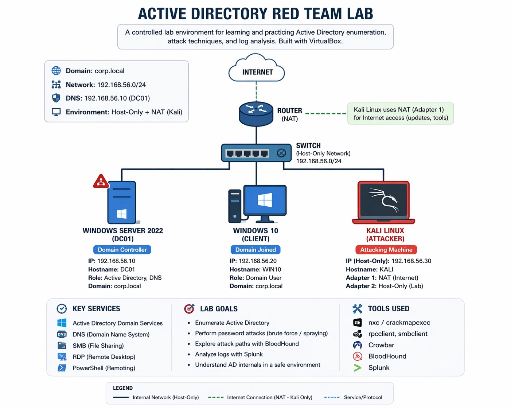

# Active Directory Red Team Lab

# Active Directory Red Team Lab

## This project demonstrates the creation of a controlled Active Directory lab using VirtualBox, consisting of a Windows Server 2022 domain controller, a Windows 10 client, and a Kali Linux attacker machine. The lab focuses on key attack phases, including enumeration, password attacks, and initial analysis using tools such as smbclient, rpcclient, crackmapexec, crowbar, and BloodHound. It provides hands-on experience with Active Directory environments, authentication mechanisms, and common red team techniques.


*Figure 1: Active Directory Lab Architecture*

## Objective

This lab aims to demonstrate a hands-on experience in an Active Directory attack within a controlled and isolated network. The project simulates a real-world configuration where offensive security techniques can be safely practiced. The lab covers network configuration, domain structure, authentication mechanisms, and common attack techniques such as enumeration, brute force, and password scarcity. Overall, the goal is to develop practical cybersecurity skills while gaining a deeper understanding of how attacks are carried out and how Active Directory environments can be exploited from an attacker's perspective.

## Skills Learned

- Setting up virtual machines using Oracle VM VirtualBox.  
- Configuring isolated networks (Host-Only + NAT).  
- Assigning static IP addresses and troubleshooting connectivity.  
- Installing and configuring Active Directory Domain Services (AD DS).  
- Promoting a Windows Server to a Domain Controller.  
- Joining a Windows 10 client to a domain.  
- Creating and managing domain users.  
- Enumerating SMB shares and domain users (`rpcclient`, `smbclient`).  
- Performing brute force attacks (`Crowbar` - RDP).  
- Performing password spraying attacks (`CrackMapExec` - SMB).  
- Understanding authentication failures and account lockout behavior.  
- Using BloodHound for attack path analysis (partial setup).  
- Documenting offensive security workflows in a structured way.

## 1. Lab Setup

### *Setting up the virtual environment*

The lab environment was built using Oracle VM VirtualBox, which was installed using the default configuration. This setup provides the foundation required to run multiple virtual machines simultaneously within an isolated environment.

### *Preparing the Windows Server machine*

Download Windows Server 2022 ISO from https://www.microsoft.com/en-us/evalcenter/evaluate-windows-server-2022 after that it was used to create a dedicated virtual machine that acts as the domain controller (DC01). The system was configured with 4GB of RAM, 2 CPUs, and a 50GB virtual disk. During installation, the Desktop Experience version was selected to simplify interaction with the system. Initial configuration was completed, including setting the administrator credentials.

### *Preparing the Windows 10 machine*

Visit https://www.microsoft.com/en-ca/software-download/windows10 the Windows 10 installation media was obtained through Microsoft’s official website using the Media Creation Tool. After generating the ISO file, a new virtual machine was created in VirtualBox to act as the client machine within the lab. The system was configured with 4GB of RAM, 2 CPUs, and a 50GB virtual disk. The ISO was mounted, and the operating system was installed following the standard installation process.

### *Setting up the attacker machine (Kali Linux)*

Get Kali Linux from https://www.kali.org/. A pre-configured Kali Linux VirtualBox image was downloaded and extracted. The virtual machine was then imported directly into VirtualBox, allowing for a faster deployment. This machine is used as the attacker system throughout the project and is responsible for performing enumeration and exploitation tasks in later stages.

## Lab Architecture Overview

| Component               | Role / Function                                                                 | Where it Runs        |
|------------------------|----------------------------------------------------------------------------------|----------------------|
| Attacker Machine       | Kali Linux used for reconnaissance, enumeration, and attack execution           | VirtualBox VM        |
| Domain Controller      | Windows Server 2022 running Active Directory, DNS, SMB, SYSVOL, NETLOGON        | VirtualBox VM        |
| Client Machine         | Windows 10 domain-joined workstation used as lateral movement target            | VirtualBox VM        |
| Isolated Network       | Host-only network (192.168.56.0/24) for secure communication between machines   | VirtualBox Network   |
| Attack Tools           | rpcclient, smbclient, crackmapexec, crowbar, BloodHound                         | Kali Linux           |
| Authentication Methods | SMB, RDP, Kerberos                                                              | Across all machines  |

### *Summary*

At this stage, the lab environment consists of three fully operational virtual machines: a Windows Server 2022 system configured to become the domain controller, a Windows 10 client machine, and a Kali Linux attacker machine. All systems have been successfully installed and are ready for network configuration and domain setup.


## 2. Network Configuration

### *Configuring network settings*

After preparing all virtual machines, network settings were configured to allow communication between systems. Each machine was connected using a Host-Only Adapter in VirtualBox, creating an isolated internal network for the lab environment.

To ensure stable and predictable communication, static IP addressing was applied across all machines. The domain controller (DC01) was assigned the IP address 192.168.56.10, the Windows 10 (Win10-Client) client machine was configured with 192.168.56.20, and the Kali Linux attacker machine was assigned 192.168.56.30. All systems operated within the same subnet (255.255.255.0).

The DNS configuration on the client machines was set to point to the domain controller, allowing proper name resolution within the domain environment.

Connectivity between machines was tested to confirm that the network configuration was functioning correctly.
Additionally, the Kali Linux machine was configured with two network adapters to support both internet access and internal lab communication.

- **Adapter 1 (NAT):** Provided internet connectivity, allowing the system to download updates and install required security tools.
- **Adapter 2 (Host-Only):** Enabled communication with the isolated internal lab network (192.168.56.0/24), facilitating interaction with the domain controller and client machine.

This dual-adapter configuration ensured that the attacker machine remained up to date while maintaining a secure and isolated environment for penetration testing activities.

## 3. Active Directory Deployment

### *Installing Active Directory Domain Services*

The Windows Server machine (DC01) was prepared to act as the domain controller by installing the Active Directory Domain Services role through the Server Manager using the "Add Roles and Features" option.

This step enabled the necessary services required to manage domain-based authentication and directory structures.

### *Promoting the server to domain controller*

Following the installation of the Active Directory role, the server was promoted to a domain controller. During this process, a new domain named `corp.local` was created, establishing the central identity and authentication system for the lab.

The promotion process was completed successfully, and the domain services were verified to ensure proper operation.

### *Configuring Active Directory and users*

With Active Directory in place, multiple users were created to simulate a realistic enterprise environment. These accounts will later be used for authentication and enumeration testing.
A test user account was also prepared to validate domain authentication from client machines.

### *Summary*

At this stage, the internal network has been fully configured, and all machines are successfully connected. Active Directory Domain Services have been installed, the server has been promoted to a domain controller, and the `corp.local` domain is operational. User accounts have been created, and the environment is now ready for client integration and further security testing.

## 4. Domain Join and Authentication

### *Configuring the client machine*

The Windows 10 client machine was configured to operate within the same internal network as the domain controller. A static IP address (192.168.56.20) was assigned, using the same subnet (255.255.255.0) as the rest of the environment to ensure proper communication.

The DNS server was configured to point to the domain controller (192.168.56.10), allowing the client machine to resolve domain services correctly and communicate with Active Directory.

These configurations ensured that the client machine was correctly integrated into the lab network and capable of interacting with the domain environment.

### *Joining the domain*

After confirming network configuration, the client machine was joined to the `corp.local` domain. This step integrated the workstation into the domain infrastructure, allowing centralized authentication through the domain controller.

The domain join process completed successfully, confirming proper communication between the client machine and the domain controller.

### *Validating domain authentication*

Authentication was tested using a domain user account created in Active Directory (`testuser`). The login was performed using the domain format (e.g., `corp\testuser`), confirming that domain authentication was working as expected.

This validation demonstrated that the client machine was fully integrated into the domain and that authentication requests were being handled correctly by the domain controller.

### *Summary*

At this stage, the Windows 10 client machine has been successfully integrated into the domain environment. Network configuration, domain join, and user authentication have all been validated, resulting in a functional enterprise-style setup ready for further security testing.

## 5. Enumeration

### *Enumerating SMB Shares*

After confirming connectivity between the attacker machine (Kali Linux) and the Domain Controller, an SMB enumeration was performed using valid domain credentials.

The following command was used:
```bash
smbclient -L //192.168.56.10 -U testuser
```
Authentication was successful, confirming that the created domain user credentials were valid.

The enumeration revealed several important shared resources:

- ADMIN$
- C$
- IPC$
- NETLOGON
- SYSVOL

The presence of SYSVOL and NETLOGON shares confirmed that the target system is functioning as a Domain Controller within the Active Directory environment.

Additionally, SMBv1 was found to be disabled, indicating a more secure and modern configuration of the SMB protocol.

This step marked the first successful authenticated interaction with the Domain Controller from the attacker machine.

### *Enumerating Domain Users*

After successfully authenticating to the Domain Controller using SMB, further enumeration was performed using RPC.

The following command was executed:

```bash
rpcclient -U testuser 192.168.56.10
```

Once authenticated, domain users were enumerated using:

enumdomusers

The results revealed multiple domain accounts, including:

- Administrator
- Guest
- krbtgt
- john.doe
- mary.smith
- backup_user
- it.support
- testuser

These accounts were previously created during the Active Directory configuration phase on the Domain Controller (DC01), simulating a realistic enterprise environment. The account testuser was specifically created as a low-privileged domain user and used to perform authenticated enumeration from the attacker machine (Kali Linux).

The presence of these accounts confirmed successful interaction with the Active Directory environment and provided valuable targets for further security testing.

Particularly, privileged and service accounts such as "Administrator" and "krbtgt" were identified, which are critical components in many Active Directory attack scenarios.

This step represents a key phase in Active Directory enumeration, enabling further attack paths such as password attacks and privilege escalation.

## Domain Enumeration

Once authenticated access to the domain was achieved, further enumeration of the Active Directory environment was conducted in order to understand its structure and identify potential attack paths.

Domain groups were enumerated using the `enumdomgroups` command within rpcclient. This revealed several important groups, including Domain Admins, Domain Users, Domain Guests, Domain Computers, Domain Controllers, Schema Admins, and Enterprise Admins. These groups provide insight into how permissions and roles are structured within the domain.

The Domain Admins group was then investigated to identify high-privilege accounts. By querying the group using `querygroupmem 0x200`, a RID was returned and resolved using `queryuser 0x1f4`. This confirmed that the account “Administrator” is a member of the Domain Admins group and holds the highest privileges within the environment.

## Credential Validation

Following enumeration, credential validation was performed using CrackMapExec. A password spray was executed against the domain controller, which successfully identified valid credentials for the account “testuser” with the password “pass1234!”.

This confirmed that the account could authenticate successfully within the domain and enabled further interaction with domain services.

## SMB Share Enumeration and SYSVOL Exploration

Using the valid credentials, SMB shares were enumerated. Several default shares were identified, including ADMIN$, C$, IPC$, NETLOGON, and SYSVOL. Read access was confirmed on both NETLOGON and SYSVOL, which are critical in domain environments.

The SYSVOL share was then accessed using smbclient. Within this directory, the domain structure was explored, including the Policies folder, which contains Group Policy Objects (GPOs) applied across the domain.

## Group Policy Analysis

Further exploration of the GPO directories revealed multiple policy folders identified by unique GUIDs. Within these directories, paths such as MACHINE, Microsoft, Windows NT, and SecEdit were examined.

A key file identified during this process was “GptTmpl.inf”, which contains security configuration settings applied across the domain. Analysis of this file revealed several important privileges, including SeBackupPrivilege, SeDebugPrivilege, and SeRemoteInteractiveLogonRight.

These findings provided valuable insight into the domain’s security posture and highlighted potential opportunities for privilege escalation.

### *Summary*

This phase confirmed successful authenticated enumeration of the Active Directory environment. It provided a clear understanding of domain structure, user privileges, and security configurations, forming a strong foundation for further attack techniques such as privilege escalation and lateral movement.

## 6. BloodHound

## BloodHound Enumeration (Attempt)

BloodHound was introduced in this lab to analyze relationships within the Active Directory environment and identify potential attack paths.

The tool was successfully installed and configured on the Kali Linux machine, including the setup of Neo4j as the backend graph database. The Neo4j service was initialized correctly, and access to the web interface (`http://localhost:7474`) was verified.

An attempt was made to collect domain data using BloodHound; however, full data ingestion was not completed due to configuration and connectivity limitations within the lab environment.

Despite this limitation, the process provided valuable insight into the operation of BloodHound, including:

- The role of Neo4j in storing and managing graph-based relationship data  
- The requirement for proper domain authentication and network connectivity  
- The ability of BloodHound to map privilege relationships and identify potential attack paths  

This step highlighted the complexity involved in Active Directory enumeration and emphasized the importance of correct configuration when using advanced security tools. The activity will be revisited in future iterations of the lab to achieve full data collection and analysis.

## 7. Password Attacks

## Brute Force Attack (RDP)

Following the enumeration and analysis phases, a brute force attack was conducted against the Remote Desktop Protocol (RDP) service on the target machine.
Using the previously identified domain user `testuser`, the attack was performed from the Kali Linux attacker machine with the tool **Crowbar**.

An initial attempt was made using a small subset of passwords extracted from the `rockyou.txt` wordlist:
```bash
head -n 20 rockyou.txt > passwords.txt
```
This attempt did not produce any valid credentials, indicating that the correct password was not included in the limited dataset.

To increase effectiveness, the full wordlist was used. However, an encoding issue was encountered due to invalid characters within the file. To resolve this, the wordlist was cleaned using:
```bash
tr -cd '\11\12\15\40-\176' < rockyou.txt > clean.txt
```
This ensured compatibility with the tool and allowed the attack to proceed without errors.

The brute force attack was then executed using:
```bash
crowbar -b rdp -u testuser -C clean.txt -s 192.168.10.200/32
```
During execution, multiple authentication attempts were made against the RDP service (port 3389), simulating a real-world password attack scenario.

Although no valid credentials were immediately identified, this phase demonstrated how attackers adapt their approach, troubleshoot technical issues, and refine attack strategies.

This exercise highlights the importance of strong password policies, restricted access to RDP services, and proper defensive configurations to mitigate brute force attacks.

## Password Spraying Behavior and System Response

During further password spraying attempts using CrackMapExec, different system responses were observed.

Initial attempts using common passwords such as `Password123` resulted in authentication failures:

- STATUS_LOGON_FAILURE indicated incorrect credentials

However, subsequent attempts triggered a different behavior:

- Connection reset by peer

This response suggests that the target system detected suspicious authentication activity and actively terminated the connection.

Possible causes include:

- Account lockout policies
- Intrusion detection mechanisms
- SMB service protections
- Firewall rules blocking repeated authentication attempts

This demonstrates how defensive mechanisms within Active Directory environments can react to brute force or password spraying attacks.

Understanding these responses is essential for both attackers and defenders, as it highlights the importance of monitoring, detection, and response strategies in enterprise environments.

## References

- Microsoft (2024) *Windows Server 2022 Documentation*. Available at: https://learn.microsoft.com/en-us/windows-server/ 

- Microsoft (2024) *Active Directory Domain Services Overview*. Available at: https://learn.microsoft.com/en-us/windows-server/identity/ad-ds/get-started/virtual-dc/active-directory-domain-services-overview

- Kali Linux (2024) *Official Documentation*. Available at: https://www.kali.org/docs/ 

- Oracle (2024) *VirtualBox Documentation*. Available at: https://www.virtualbox.org/wiki/Documentation 

- BloodHound (2024) *Documentation*. Available at: https://bloodhound.readthedocs.io/

- Neo4j (2024) *Documentation*. Available at: https://neo4j.com/docs/ 

- byt3bl33d3r (2024) *CrackMapExec*. Available at: https://github.com/byt3bl33d3r/CrackMapExec 

- galkan (2024) *Crowbar Tool*. Available at: https://github.com/galkan/crowbar 

- MITRE (2024) *ATT&CK Framework*. Available at: https://attack.mitre.org/ 

- MyDFIR (2024) *YouTube Channel*. Available at: https://www.youtube.com/@MyDFIR